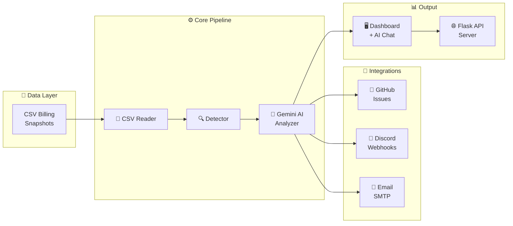

<div align="center">

# ☁️ Cloud IQ — AI-Powered Cloud Cost Optimizer

### *Autonomous cost intelligence for modern cloud infrastructure*

[](https://python.org)
[](https://flask.palletsprojects.com)
[](https://ai.google.dev)
[](https://render.com)
[](LICENSE)

<br/>

**Cloud IQ** is an autonomous AI agent that scans cloud billing data, detects idle and oversized resources using Gemini AI, files prioritized GitHub issues, sends Discord & email alerts, and serves a premium interactive dashboard with an embedded AI chatbot.

<br/>

[🚀 Live Demo](#deployment) · [📊 Features](#-key-features) · [⚡ Quick Start](#-quick-start) · [📖 Documentation](#-architecture)

---

</div>

## 🎯 Business Problem

Cloud teams routinely waste **30-40% of their budget** on:

| 💸 Problem | 📋 Example |
|:---:|:---|
| **Idle Compute** | EC2 instances at 3% CPU running for weeks |
| **Oversized Databases** | RDS provisioned for peak but averaging 7% utilization |
| **Stale Resources** | Resources inactive 30+ days still incurring $200+/month |

> **Cloud IQ automates discovery**, prioritizes findings by severity & savings, routes actionable alerts to GitHub, Discord & email, and serves a visual dashboard for stakeholders — all powered by **Google Gemini 2.0 Flash AI**.

---

## ✨ Key Features

<table>
<tr>
<td width="50%">

### 🤖 AI-Powered Analysis
- **Gemini 2.0 Flash** explains *why* each resource is wasteful
- Structured JSON analysis with severity, reason, recommendation
- Rule-based fallback when API is unavailable

### 📊 Interactive Dashboard
- Premium dark-themed UI with animated counters
- SVG donut charts & weekly trend visualizations
- Resource inventory with live search & filtering
- Interactive savings calculator with slider

</td>
<td width="50%">

### 🔔 Multi-Channel Alerts
- **GitHub Issues** — Auto-filed with P0/P1/P2 labels
- **Discord Webhooks** — Rich embed alerts for critical findings
- **Email Reports** — Beautiful HTML reports via Gmail SMTP

### 💬 AI Chatbot
- Embedded cloud cost assistant in dashboard
- 10+ pre-built quick questions
- Resource lookup, cost forecast, reduction roadmap
- Live API chat powered by Gemini AI

</td>
</tr>
</table>

### All Features at a Glance

| Feature | Description | Status |
|:--------|:------------|:------:|
| CSV Billing Ingestion | Loads & validates weekly billing snapshots | ✅ |
| Heuristic Detection | Flags idle/oversized EC2, RDS, S3 resources | ✅ |
| Gemini AI Analysis | Deep analysis with severity & recommendations | ✅ |
| Rule-Based Fallback | Pipeline continues when AI is unavailable | ✅ |
| GitHub Issue Filing | Auto-creates labeled issues with dedup | ✅ |
| Discord Alerts | Rich embed alerts + scan summaries | ✅ |
| Email Reports | Styled HTML reports via Gmail SMTP | ✅ |
| Interactive Dashboard | Premium charts, trends, AI chat | ✅ |
| Live Scan from Dashboard | One-click rescan from web UI | ✅ |
| Savings Calculator | Interactive remediation planner | ✅ |
| Budget Alerts | Threshold-based overspend warnings | ✅ |
| Weekly Trends | 4-week cost trend visualization | ✅ |
| Dark/Light Theme | Toggle between themes | ✅ |
| Export CSV/JSON | Download reports from dashboard | ✅ |
| Cloud Deployment | Render-ready with Blueprint | ✅ |

---

## 🏗️ Architecture



---

## ⚡ Quick Start

### Prerequisites

- Python 3.10+
- pip
- A [Gemini API Key](https://aistudio.google.com/apikey) (free tier available)

### 1️⃣ Clone & Install

```bash
git clone https://github.com/HARINI-MOHAN-KUMAR/cloud_cost_optimizer_mock.git
cd cloud_cost_optimizer_mock
pip install -r requirements.txt
```

### 2️⃣ Configure Environment

```bash
cp .env.example .env
# Edit .env with your API keys and credentials
```

### 3️⃣ Run Locally

```bash
# Start the Flask web server
python app.py

# Or run the CLI pipeline
python -m project.main --email --discord
```

Visit **http://localhost:5000** to see the dashboard.

---

## 📂 Project Structure

```
Cloud_IQ/
├── app.py                    # 🌐 Flask web server (entry point)
├── Procfile                  # 🚀 Render deployment command
├── render.yaml               # ☁️ Render Blueprint config
├── requirements.txt          # 📦 Python dependencies
├── runtime.txt               # 🐍 Python version spec
├── .env.example              # 🔑 Environment template
│
├── project/
│   ├── config.py             # ⚙️ Settings, thresholds, feature flags
│   ├── main.py               # 🎯 CLI pipeline orchestrator
│   │
│   ├── data/                 # 📊 Weekly billing CSV snapshots
│   │   ├── cloud_billing_week1.csv
│   │   ├── cloud_billing_week2.csv
│   │   ├── cloud_billing_week3.csv
│   │   └── cloud_billing_week4.csv  ← current week
│   │
│   ├── src/                  # 🧠 Core modules
│   │   ├── reader.py         # CSV ingestion & validation
│   │   ├── detector.py       # Idle/oversized detection
│   │   ├── llm_analyzer.py   # Gemini AI integration
│   │   ├── ai_agent.py       # Agent loop wrapper
│   │   ├── github_issues.py  # GitHub issue creation
│   │   ├── discord_alert.py  # Discord webhook alerts
│   │   ├── email_report.py   # SMTP email reports
│   │   └── html_report.py    # Dashboard generator + chat
│   │
│   ├── templates/            # 📧 Email HTML templates
│   └── output/               # 📁 Generated dashboard & data
│
├── Documents/                # 📄 Project documentation
├── Team_Details/             # 👥 Team information
└── Video/                    # 🎥 Demo videos
```

---

## 🔍 Detection Rules

### Severity Levels

| Severity | Criteria | Color |
|:---------|:---------|:-----:|
| 🚨 **P0** Critical | Savings > $250, CPU < 3%, or inactive > 30 days | 🔴 Red |
| ⚠️ **P1** Warning | Savings ≥ $120, or CPU < 7% | 🟡 Yellow |
| 💡 **P2** Low | Other flagged resources | 🟢 Green |

### Savings Estimation

| Condition | Savings Rate |
|:----------|:------------|
| Stale resource (>30 days) | Up to **90%** of monthly cost |
| Low CPU/memory | Up to **75%** of monthly cost |
| Oversized (CPU <15%, cost >$150) | Up to **55%** of monthly cost |
| Other flagged resources | Up to **35%** of monthly cost |

---

## 🌐 API Endpoints

The Flask server exposes these REST endpoints:

| Method | Endpoint | Description |
|:-------|:---------|:------------|
| `GET` | `/` | Serve interactive dashboard |
| `GET` | `/api/health` | Health check for monitoring |
| `POST` | `/api/scan` | Run full scan pipeline |
| `POST` | `/api/notify/email` | Send email report |
| `POST` | `/api/notify/discord` | Send Discord alert |
| `POST` | `/api/notify/all` | Send all notifications |
| `POST` | `/api/chat` | AI chatbot endpoint |
| `GET` | `/api/trends` | Weekly trend data |

---

## 🔌 Integrations

### 🐙 GitHub Issues
- Auto-creates issues: `[P0] ec2-web-04 is underutilized — save $180/month`
- Labels: `cost-optimization`, `P0-critical` / `P1-warning` / `P2-low`
- Duplicate detection before filing
- Full resource metrics + AI analysis in issue body

### 💬 Discord Alerts
- **P0 critical alerts** — Rich embed per critical finding
- **Scan summary** — P0/P1/P2 breakdown with total savings
- **Budget alerts** — `@here` ping when spend exceeds threshold
- Color-coded embeds with retry & rate-limit handling

### 📧 Email Reports
- Professional HTML template matching dashboard theme
- Summary cards: issues found, savings, total spend
- Per-resource table with severity, saving, recommendation
- Budget alert emails with actionable insights

---

## 🚀 Deployment

### Deploy to Render (Recommended)

This project includes a `render.yaml` Blueprint for one-click deployment:

1. Fork this repository
2. Go to [dashboard.render.com](https://dashboard.render.com)
3. Click **New** → **Blueprint**
4. Connect your GitHub repo
5. Set environment variables (API keys, email credentials)
6. Deploy! 🎉

### Environment Variables for Deployment

| Variable | Required | Description |
|:---------|:--------:|:------------|
| `GEMINI_API_KEY` | ✅ | Google AI Studio API key |
| `GITHUB_TOKEN` | Optional | GitHub PAT for issue filing |
| `DISCORD_WEBHOOK_URL` | Optional | Discord webhook for alerts |
| `EMAIL_SENDER` | Optional | Gmail sender address |
| `EMAIL_PASSWORD` | Optional | Gmail App Password |
| `EMAIL_RECEIVER` | Optional | Report recipient email |
| `BUDGET_THRESHOLD` | Optional | Budget alert threshold ($) |

---

## 🛠️ Tech Stack

| Layer | Technology |
|:------|:-----------|
| **Language** | Python 3.10+ |
| **Web Framework** | Flask 3.0 |
| **AI Engine** | Google Gemini 2.0 Flash |
| **WSGI Server** | Gunicorn |
| **Dashboard** | Pure HTML/CSS/JS with SVG charts |
| **Email** | SMTP + Gmail App Passwords |
| **Notifications** | Discord Webhooks (rich embeds) |
| **Issue Tracking** | GitHub REST API v3 |
| **Deployment** | Render (Blueprint) |
| **Data Format** | CSV billing snapshots |

---

## 📊 Sample Data

The `project/data/` folder contains **4 weeks** of mock AWS-style billing:

| Resource | Type | CPU | Cost/mo | Status |
|:---------|:-----|:---:|:-------:|:------:|
| `ec2-web-04` | EC2 | 3% | $200 | 🚨 P0 |
| `rds-db-04` | RDS | 7% | $350 | 🚨 P0 |
| `s3-archive-02` | S3 | 0% | $100 | 🚨 P0 |
| `rds-analytics-02` | RDS | 14% | $320 | ⚠️ P1 |
| `ec2-dev-02` | EC2 | 9% | $180 | ⚠️ P1 |
| `ec2-api-04` | EC2 | 61% | $205 | ✅ Healthy |
| `ec2-batch-04` | EC2 | 73% | $215 | ✅ Healthy |

---

## 📋 CLI Reference

```bash
# Standard scan with all integrations
python -m project.main --email --discord --github

# Ask AI a cloud cost question
python -m project.main --ask "How can I reduce RDS costs?"

# Generate AI training dataset
python -m project.main --train

# Live watch mode (auto-refresh on CSV change)
python -m project.main --watch 10

# Full production run
python -m project.main --watch 10 --github --discord --email --ai --serve
```

---

## 👥 Team

**Cloud IQ** — Built as an autonomous cloud cost optimization platform with clean module separation, resilient error handling, and production-ready deployment capabilities.

| Role | Contributor |
|:-----|:-----------|
| Developer | HARINI MOHAN KUMAR |

---

<div align="center">

### ⭐ Star this repo if you find it useful!

Made with ❤️ for smarter cloud spending

[](https://github.com/HARINI-MOHAN-KUMAR)

</div>